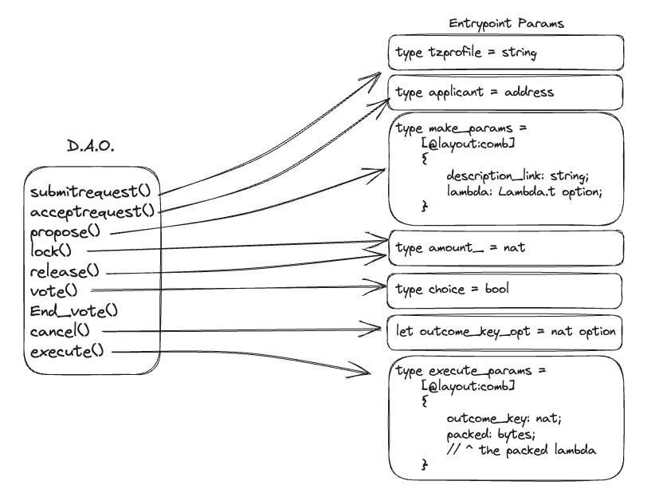

# Contract Specification

## Entrypoints

## Workflow

The contract is using locked tokens of the configured ***governance_token*** 
as voting power, along with additional whitelist & anti-whale measures.

The potential incentives to lock tokens (outside of getting voting power) is
uncovered.

## D.I.D. Whitelist

The D.A.O. uses a whitelist system to invite members to the dApp.
An initial map of `members` must be specified at the origination of the contract.

An external user of the D.A.O. must then :
- submit an access request by calling the entrypoint `SubmitAccessRequest`
- wait for an already existing member to accept their request, 
    by calling the entrypoint`AcceptAccessRequest`

Each request and each member have a `string` value attached to their address.
This allows for user to attach either their [Tzprofile](https://tzprofiles.com/) address, 
or the URL pointing to a post on their social profile, or a Gist that states 
they are the rightful owners of the specified address.

> [!NOTE]
> Unfortunately, the [Tzprofile](https://tzprofiles.com/) project does not offer 
> any on-chain registry allowing the D.A.O. to have a truly decentralized checking process.
> Since there are no on-chain view or callbacks that can be used to check 
> the applicants' profiles, we decided to leave the `tzprofile` field as 
> a generic `string` to allow applicants to attach other means to justify 
> their identities.

## Anti-Whale System

The D.A.O. uses an anti-whale voting system, working as follows :

- Each user has a token score. For each vote, the base token score is initialised 
in the configuration at `s = 1 000 000`, and this value is added to the user 
locked tokens for this vote `x`, resulting in a final token score `X = s + x`.

- Each user has a reputation score. The base reputation score is initialised in 
the configuration at `b = 10` for smoothing purpose.  At each successful vote, 
each user is rewarded one cumulative reputation point in a counter `y`, 
resulting in a final reputation score `Y = b + y`.

- Each user has a fidelity score. The base fidelity score is initialised in 
the configuration at `t = 31 536 000` for smoothing purpose. At each lock, 
we note the timestamp, and calculate at each vote the total lock 
time `z` in seconds. Note that locking and releasing multiple times cumulate 
your lock time.  resulting in a final fidelity score `Z = t + z`.

### Propose

A token owner can *propose* a vote by supplying a ***description_link***,
and an optional tuple of type ***Lambda.t*** composed by a ***hash*** and a ***kind***.
As SPAM protection mechanism, the configured ***deposit_amount*** of tokens is
transferred from the owner to the DAO. This amount will be sent back to
the proposal creator if configured ***refund_threshold*** participation is
reached by the end of the vote.

### Lock

To convert their tokens to voting power, owners can *lock* them.
The lock mechanism consists in a transfer from the owner to the DAO contract address,
and tracking the balance of locked tokens in the storage.
Locking can only be done outside voting periods.

### Release

Token owners can also *release* their tokens, then the DAO contract
transfers locked token and updates the vault balance. Releasing can only be done
outside voting periods.

### Vote

After a configured ***start_delay*** elapsed time, token owners can *vote*
during a configured ***voting_period***. Token owners can vote on the proposal,
having their locked tokens being counted as voting power.

### End_vote

After the ***voting_period*** has elapsed, anyone can *end_vote*.
The vote result is computed, according to configured ***quorum_threshold***
and ***super_majority***, either the proposal is ***Accepted***,
and a timelock is created, or the proposal is **Rejected**.
When Rejected, The ***deposit_amount*** is either sent back to the proposal
creator or burned if the ***quorum_threshold*** haven't been met.

### Cancel

The proposal creator can *cancel* the proposal outside the ***voting_period***
or the ***timelock_period***. The ***deposit_amount*** is burned.

### Execute

After a ***timelock_delay*** and for a ***timelock_period***, anyone can *execute*
a given lambda if it matches the hash associated to the proposal.

